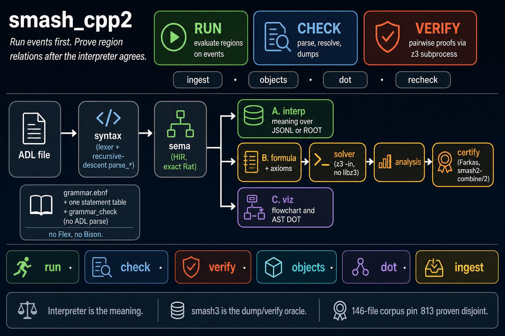
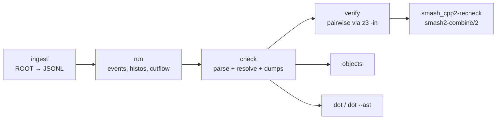
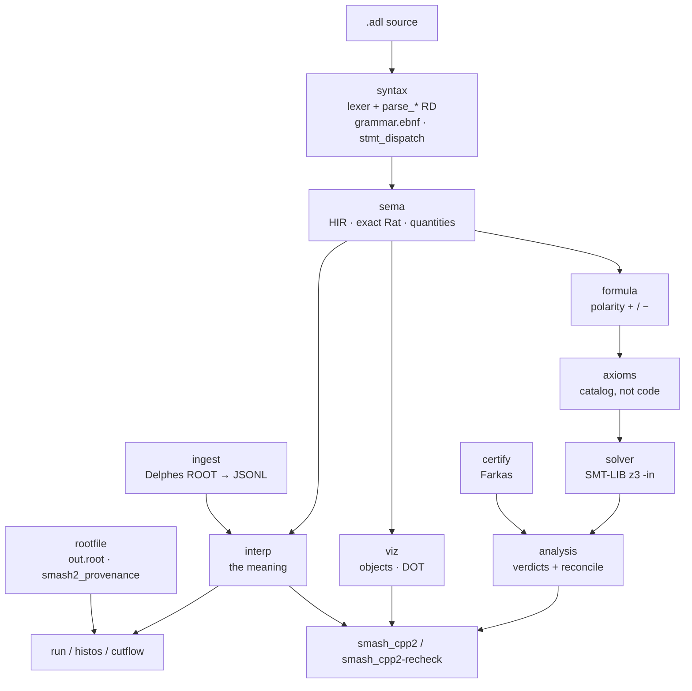

# smash_cpp2 architecture

Run analyses over events first. Prove region relations after the
interpreter agrees with the file.



The poster is the explainer. This page is the same picture in text and
Mermaid, so the labels stay reviewable.

## Daily loop

`run` is first in `--help`. The interpreter is the meaning. `verify`
comes after `check` agrees with the file.



| Command | What it does |
|---|---|
| `run` | Evaluate regions over JSONL, or ROOT with `--profile`. `--json`, `--histos DIR` (histos, cutflow, bridges, `out.root`). |
| `check` | Parse and resolve. `--dump-ast`, `--dump-hir`, `--dump-quantities`, `--dump-formula`, `--dump-axioms`, `--json`. |
| `verify` | Pairwise verdicts, vacuity, bins. `--cross`, `--json`, `--combine DIR`. Subprocess `z3 -in`. No libz3. |
| `objects` | One aligned row per declared collection. |
| `dot` | Graphviz flowchart from the HIR. `dot --ast` for the parse tree. |
| `ingest` | ROOT under a converter profile (Delphes) → canonical JSONL. |
| `smash_cpp2-recheck` | Replay `smash2-combine/2` bundles offline. No solver. |

## Library spine

Libraries keep the `adl2_*` CMake names. The binary is `smash_cpp2`.

```
syntax → sema → {interp ‖ formula ‖ viz} → axioms → solver
          ingest (leaf)                       ↘ certify ↗ analysis → cli
          rootfile (leaf)                          interp → histo / bridges
```



Hostile statement-layer productions stay named hooks (column-1 `define`,
contextual `bins`, path tokens, particle lists, bin-body fork). Flex and
Bison are not the implementation.

Grammar edit path: `grammar.ebnf` → `method_map.txt` row → one
`stmt_dispatch.hpp` row → `parse_*` → `scripts/grammar_check.py`
(does not parse ADL).

## Trust

| Rule | Where it lives |
|---|---|
| The interpreter is the meaning | `libs/interp` |
| Language decisions are closed | `LANGUAGE.md` |
| Dumps and verify match smash3 on 146 files | `scripts/ci_gates.sh` |
| PROVEN DISJOINT pin 813; no unexplained rise | `scripts/verify_corpus_gate.sh` |
| Solver is a `z3` binary on PATH | `libs/solver` |
| Certificates replay without a solver | `smash_cpp2-recheck` |
